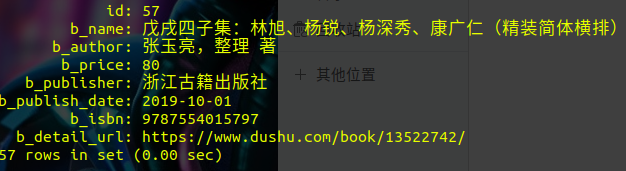

# 读书网爬虫

如果对您有帮助，希望给个 Star ⭐，谢谢！😁😘🎁🎉

Github 项目地址 [pighui](https://github.com/pighui)/[dushu](https://github.com/pighui/dushu)

# 简介

基于Scrapy框架的读书网信息爬取

爬虫入口地址：http://www.dushu.com/book/

实现了以下部分：

- 信息提取

书名，作者，价格，出版商，出版日期，条形码编号，详情页面链接

- mysql数据库存储

# 克隆项目

```bash
git clone git@github.com:pighui/dushu.git
```

# 项目启动

## 1.安装Python

```
sudo apt install python
```

## 2.安装依赖包

```bash
cd dushu
pip install -r requirements.txt
```

## 3.项目配置

修改settings.py文件

## 3.运行爬虫

```bash
scrapy crawl book
```

# 数据概览

