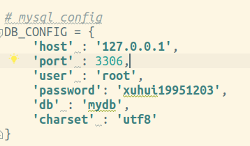
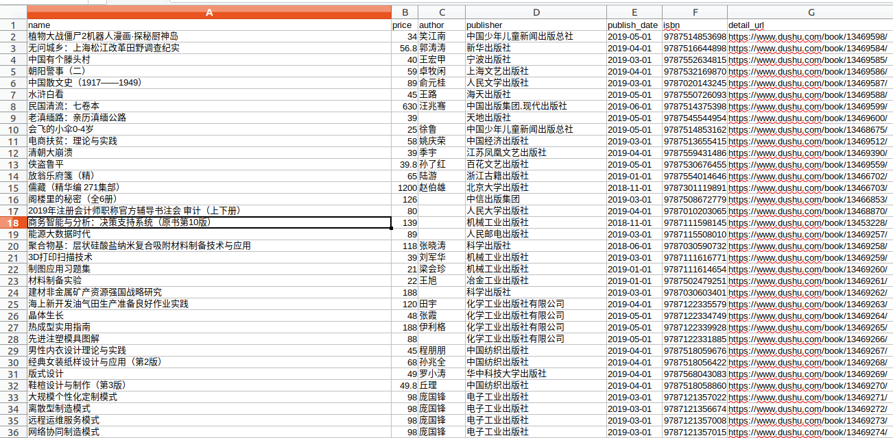

# 读书网

如果对您有帮助，希望给个 Star ⭐，谢谢！😁😘🎁🎉

Github 项目地址 [pighui](https://github.com/pighui)/[dushu](https://github.com/pighui/dushu)

# 简介

基于Scrapy框架的读书网信息爬取

爬虫入口地址：http://www.dushu.com/book/

实现了以下部分：

- 信息提取

图书名，作者，价格，出版商，出版日期，条形码编号，详情页面链接

- 写入数据库

建表，插入，sql执行，事务提交自动化

- 写入csv文件

使用scrapy内置文件写入功能，实现数据库，文件写入同步

# 克隆项目

```bash
git clone git@github.com:pighui/dushu.git
```


# 项目启动

## 1.安装环境包

测试环境：python3.6

```bash
cd dushu
pip install -r requirements.txt
```

**或者**

```bash
pip install scrapy pymysql
```

## 2.项目配置

在settings.py脚本中配置DB_CONFIG字段



## 3.运行爬虫

写入csv文件和mysql

```bash
scrapy crawl book -o books.csv
```

只写入数据库的

```bash
scrapy crawl book
```

# 数据概览

## 1.csv文件



## 2.mysql数据库

**数据比较多，爬虫运行完一共 1344400 条数据**

